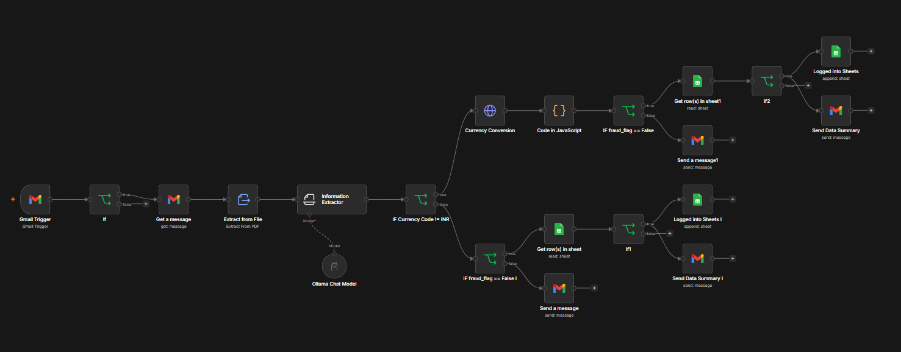

#  AI-Powered Invoice Processing Automation

This is an intelligent invoice automation workflow built using **n8n** and **Ollama (Llama 3.1)**. It automatically monitors incoming invoice emails, extracts structured information from PDF invoices, validates GST details, converts foreign currencies to INR, detects suspicious invoices, prevents duplicate entries, logs approved invoices into Google Sheets, and sends email notifications.

---

##  Features

- Automatic Gmail Invoice Monitoring
- PDF Invoice Parsing
- AI-powered Invoice Information Extraction (Ollama Llama 3.1)
- Multi-Currency Support with INR Conversion
- GST Detection & Validation
- Fraud Detection (Missing GSTIN Check)
- Duplicate Invoice Detection
- Automatic Google Sheets Logging
- Email Summary Notifications
- Fully Automated n8n Workflow

---

#  Workflow

```
Incoming Gmail Invoice
        │
        ▼
 Gmail Trigger
        │
        ▼
 Download Attachment
        │
        ▼
 Extract PDF Text
        │
        ▼
 AI Information Extractor
        │
        ▼
Is Currency = INR?
     ┌──────┴──────┐
     │             │
   Yes            No
     │             │
     │      Currency Conversion
     │             │
     └──────┬──────┘
            ▼
      Fraud Detection
            │
     ┌──────┴──────┐
     │             │
 Approved      Flagged
     │             │
 Duplicate     Alert Email
  Check
     │
     ▼
Google Sheets
     │
     ▼
Summary Email
```

---

##  Workflow Steps

### 1. Gmail Trigger
Continuously monitors Gmail for unread emails containing invoice PDF attachments.

---

### 2. Download Attachment
Automatically downloads the attached invoice PDF.

---

### 3. Extract PDF Text
Converts the invoice PDF into plain text for AI processing.

---

### 4. AI Information Extraction

Using **Ollama Llama 3.1**, the workflow extracts:

- Vendor Name
- Invoice Number
- Invoice Date
- Total Amount
- GST Amount
- Vendor GSTIN
- Currency Code
- Fraud Flag
- Fraud Reason

---

### 5. Currency Conversion

If the invoice currency is **not INR**, the workflow automatically:

- Fetches the latest exchange rate
- Converts Total Amount → INR
- Converts GST Amount → INR

---

### 6. Fraud Detection

Invoices are flagged when:

- GST has been charged
- Vendor GSTIN is missing

Flagged invoices:

- are rejected
- generate an alert email
- are not stored

---

### 7. Duplicate Invoice Detection

Before inserting data, the workflow checks Google Sheets for the same invoice number.

If found:

- Duplicate entry is prevented.

Otherwise:

- Invoice is stored.

---

### 8. Store Invoice

Approved invoices are appended into Google Sheets.

Example:

| Vendor | Invoice | Date | Amount (INR) | GST (INR) |
|---------|----------|------|--------------|-----------|
| TechNova Solutions Pvt. Ltd. | INV-2026-0619 | June 19, 2026 | 121540 | 18540 |

---

### 9. Email Notification

A summary email is automatically sent containing:

- Vendor Name
- Invoice Number
- Total Amount
- GST Amount

---

# 🖼 Demo

## Workflow



---

## Sample Invoice


---

## Google Sheets Output


---

## Email Notification


---

# 🛠 Tech Stack

| Technology | Purpose |
|------------|---------|
| n8n | Workflow Automation |
| Ollama (Llama 3.1) | Local LLM |
| Gmail API | Email Monitoring |
| Extract From File | PDF Parsing |
| Information Extractor | AI Data Extraction |
| Google Sheets API | Invoice Storage |
| Exchange Rate API | Currency Conversion |

---


#  Use Cases

- Small Businesses
- Freelancers
- Finance Teams
- Accounts Payable Automation
- Invoice Digitization
- Bookkeeping Automation

---

# Highlights

- End-to-end invoice automation
- Local AI (No cloud LLM required)
- Multi-currency support
- Fraud detection
- Duplicate prevention
- Google Sheets integration
- Email notifications
- Fully built in n8n

---

## 👨‍💻 Author

**Kaustubh Nikam (Team 1 ECell)**
